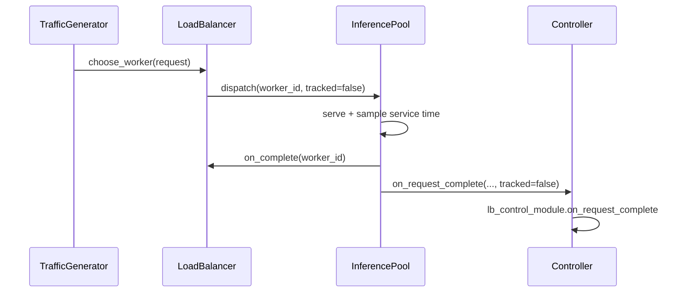
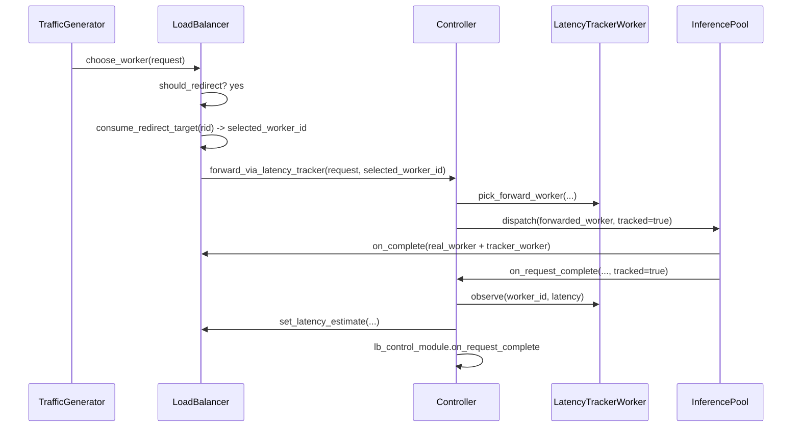
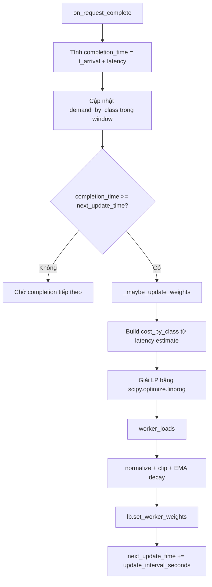

# Biểu Đồ Luồng Chi Tiết

## 1) Sequence runtime (request trực tiếp)

```mermaid
sequenceDiagram
    participant TG as TrafficGenerator
    participant LB as LoadBalancer
    participant IP as InferencePool
    participant C as Controller
    TG->>LB: choose_worker(request)
    LB->>IP: dispatch(worker_id, tracked=false)
    IP->>IP: serve + sample service time
    IP->>LB: on_complete(worker_id)
    IP->>C: on_request_complete(..., tracked=false)
    C->>C: lb_control_module.on_request_complete
```

## 2) Sequence runtime (request qua latency tracker)

```mermaid
sequenceDiagram
    participant TG as TrafficGenerator
    participant LB as LoadBalancer
    participant C as Controller
    participant LT as LatencyTrackerWorker
    participant IP as InferencePool
    TG->>LB: choose_worker(request)
    LB->>LB: should_redirect? yes
    LB->>LB: consume_redirect_target(rid) -> selected_worker_id
    LB->>C: forward_via_latency_tracker(request, selected_worker_id)
    C->>LT: pick_forward_worker(...)
    C->>IP: dispatch(forwarded_worker, tracked=true)
    IP->>LB: on_complete(real_worker + tracker_worker)
    IP->>C: on_request_complete(..., tracked=true)
    C->>LT: observe(worker_id, latency)
    C->>LB: set_latency_estimate(...)
    C->>C: lb_control_module.on_request_complete
```

## 3) Luồng update WRR LP theo thời gian

```mermaid
flowchart TD
    A["on_request_complete"] --> B["Tính completion_time = t_arrival + latency"]
    B --> C["Cập nhật demand_by_class trong window"]
    C --> D{completion_time >= next_update_time?}
    D -- Không --> E["Chờ completion tiếp theo"]
    D -- Có --> F["_maybe_update_weights"]
    F --> G["Build cost_by_class từ latency estimate"]
    G --> H["Giải LP bằng scipy.optimize.linprog"]
    H --> I["worker_loads"]
    I --> J["normalize + clip + EMA decay"]
    J --> K["lb.set_worker_weights"]
    K --> L["next_update_time += update_interval_seconds"]
```
