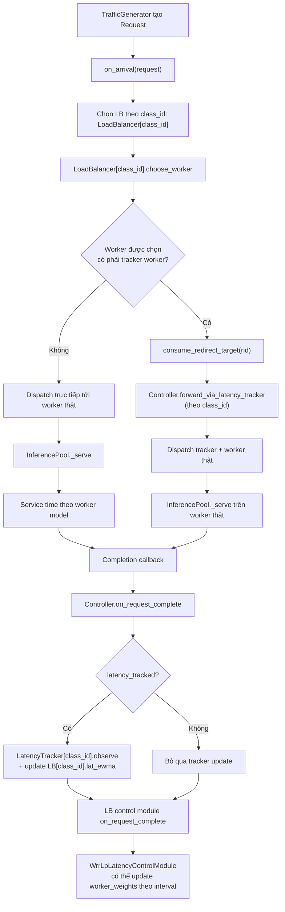

# Flow Chart Xử Lý Request

## Ghi chú
- Tracker không xử lý service time thực tế; tracker chỉ làm bước redirect/sampling.
- Mỗi service class có LB riêng và tracker state riêng.
- Completion luôn phát sinh tại worker thật; callback controller quyết định có dùng sample đó để update latency hay không.

## Xem thêm
- Kiến trúc: [architecture_overview](architecture_overview.md)
- Luồng chi tiết: [flow_diagrams](flow_diagrams.md)
