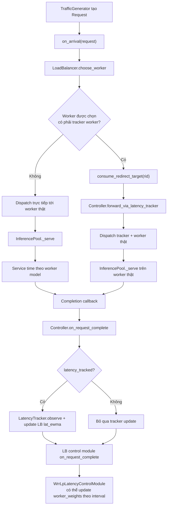

# Flow Chart Xử Lý Request

## Ghi chú
- Tracker không xử lý service time thực tế; tracker chỉ làm bước redirect/sampling.
- Completion luôn phát sinh tại worker thật; callback controller quyết định có dùng sample đó để update latency hay không.
